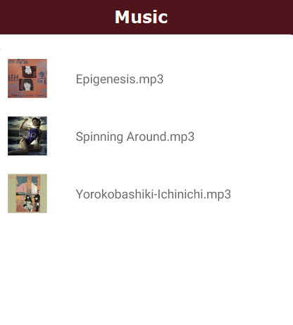
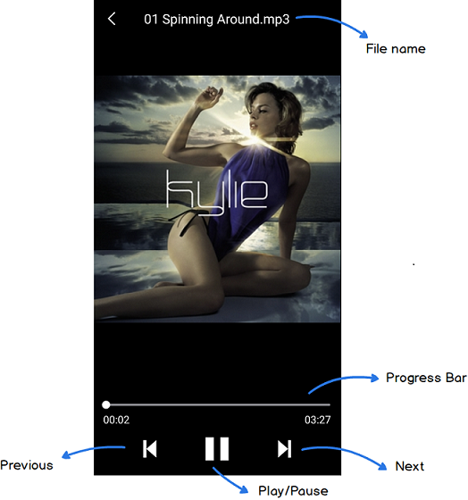
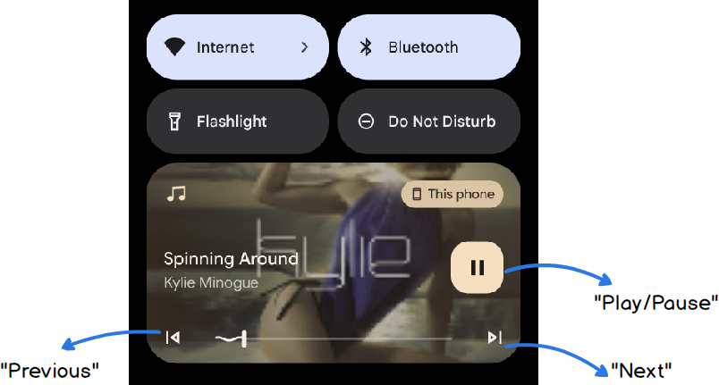

## To Android APP Developer Candidate

Hi, Thanks for your interest in the position. We have an Android APP exam before interview.
Please finish it and commit your code to GitLab before interview.

**You may need the permission to commit and create branch, please provide your GitLab account to us.**

**Please create a new branch for your commit.**

# Music Player App

Design an Android app that lists media files, that user can select an item to play.
Please create a music control in notificaion for the basic operations : Play/Pause, Previous, Next.

## Get Started

Please install Android Studio first. https://developer.android.com/studio

In this APP, you have to finish the following features :

### 1. List View

Please create a listview and show the music files. 

You can find sample files in [Sample files](TsMusicPlayerExam/app/src/main/assets/)

Check list :
- [ ] Title - Music
- [ ] AlbumArt Image - File Thumbnail
- [ ] File Name

### 2. Music Player

Tap a music file in #1 List View and start the Music Player. 

Please create a music player  the file name and provide Previous, Next and Play/Pause buttons. 

Check list :
- [ ] Back button (Back to listview)
- [ ] Title - File Name
- [ ] AlbumArt Image - File Thumbnail
- [ ] Porgress bar (seek and time)
- [ ] Play and Pause button
- [ ] Previous song button
- [ ] Next song button

Please use these [Icons](TsMusicPlayerExam/app/src/main/res/)

### 3. Music Control in Notification

When the App is running in background, please create a music control in notification panel.

Please provide action buttons for Play/Puase, Previous and Next on music control.

Check list :
- [ ] Play / Pause button
- [ ] Previous song button
- [ ] Next song button
- [ ] AlbumArt Icon

Reference :
https://developer.android.com/media/implement/surfaces/mobile

